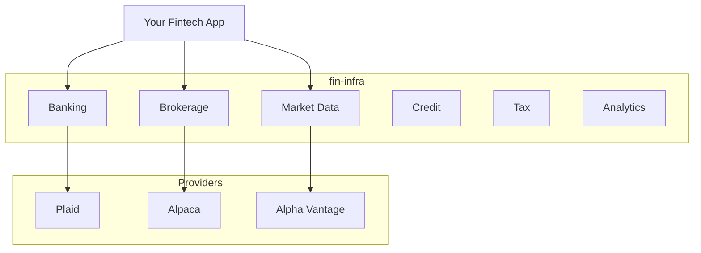

# fin-infra

**Generic, reusable financial infrastructure package for fintech applications**

fin-infra is a comprehensive Python package that provides financial primitives for any fintech application - personal finance apps, wealth management platforms, banking apps, investment trackers, budgeting tools, and more.

## Features

<div class="grid cards" markdown>

-   :material-bank:{ .lg .middle } **Banking**

    ---

    Bank account aggregation via Plaid, Teller, and MX integrations.

    [:octicons-arrow-right-24: Banking docs](banking/index.md)

-   :material-chart-line:{ .lg .middle } **Brokerage**

    ---

    Trading integrations with Alpaca, Interactive Brokers, and more.

    [:octicons-arrow-right-24: Brokerage docs](brokerage.md)

-   :material-finance:{ .lg .middle } **Market Data**

    ---

    Real-time and historical quotes for stocks, crypto, and forex.

    [:octicons-arrow-right-24: Market Data docs](market-data.md)

-   :material-wallet:{ .lg .middle } **Personal Finance**

    ---

    Net worth tracking, budgeting, goals, and cashflow analysis.

    [:octicons-arrow-right-24: Net Worth docs](net-worth.md)

-   :material-tag:{ .lg .middle } **Categorization**

    ---

    Transaction categorization with ML and rule-based approaches.

    [:octicons-arrow-right-24: Categorization docs](categorization.md)

-   :material-file-document:{ .lg .middle } **Tax & Compliance**

    ---

    Tax document management, crypto gains tracking, and compliance.

    [:octicons-arrow-right-24: Tax docs](tax.md)

</div>

## Quick Start

```python
from fin_infra.banking import easy_banking
from fin_infra.markets import easy_market

# Connect to banking provider
banking = easy_banking(provider="plaid")
accounts = await banking.get_accounts(access_token)

# Get market data
market = easy_market(provider="alphavantage")
quote = market.quote("AAPL")
print(f"Apple: ${quote.price}")
```

## Installation

```bash
pip install fin-infra
```

With extras:

```bash
pip install fin-infra[plaid,alpaca,crypto]
```

## Use Cases

fin-infra serves many types of fintech applications:

| Application Type | Example Apps | Key Features Used |
|------------------|--------------|-------------------|
| Personal Finance | Mint, YNAB, Personal Capital | Banking, Net Worth, Budgets |
| Investment Platforms | Robinhood, Webull | Brokerage, Market Data, Analytics |
| Banking Apps | Chime, Revolut | Account Aggregation, Categorization |
| Wealth Management | Betterment, Wealthfront | Portfolio Analytics, Rebalancing |
| Budgeting Tools | Simplifi, PocketGuard | Cashflow, Recurring Detection |
| Tax Planning | TurboTax, H&R Block | Tax Data, Crypto Gains |
| Credit Monitoring | Credit Karma | Credit Score, Report Analysis |

## Architecture



## License

MIT License - see [LICENSE](https://github.com/nfraxlab/fin-infra/blob/main/LICENSE) for details.
